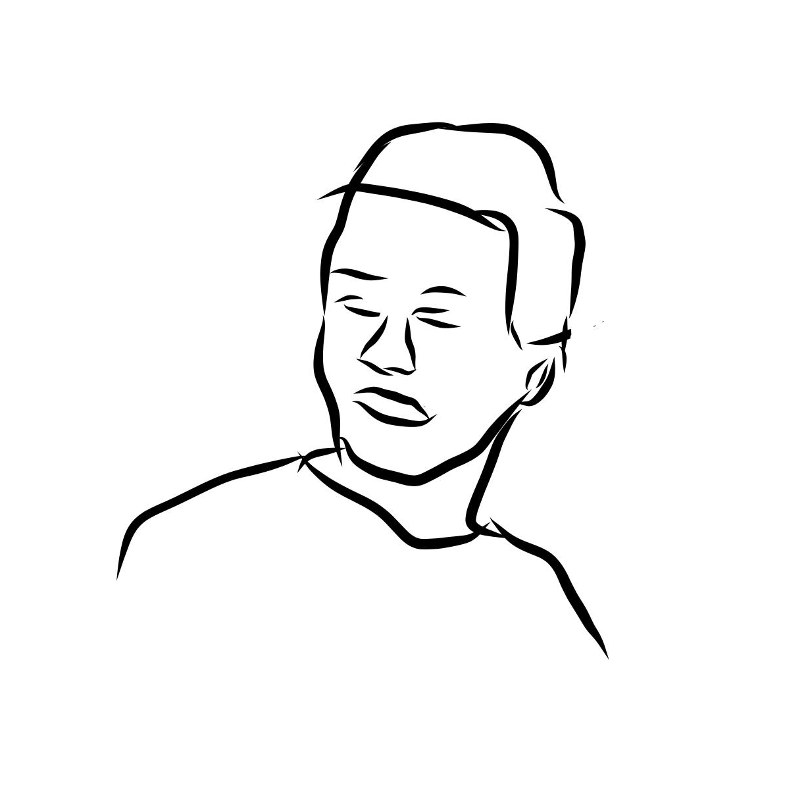

<h3>
  <samp>
    > Hey!, I am
    <b><a target="_blank" href="https://portfolio.by-mika.dev/">mika.dev</a></b>
  </samp>
</h3>

<h3>
    <samp>
      > I am an experienced developer who loves coding. Since 2015, I have acquired experience in numerous programming languages, concepts, and tools. In my free time, I enjoy bouldering.
    </samp>
</h3>

<h3>
    <samp>
      > Currently working on <b><a href="https://github.com/Developer-Mike/sprout">Sprout</a></b>, <b><a href="https://github.com/Developer-Mike/obsidian-advanced-canvas">Advanced Canvas</a></b> and <b><a href="https://play.google.com/store/apps/details?id=com.mike.standartstats">FN Track</a></b>
    </samp>
</h3>

<h3>
  
</h3>

---

  <table border-width="0">
    <tbody>
      <tr>
        <td align="center">
          <h6>Android App Development</h6>
          
        </td>
        <td align="center"> 
          <h6>Websites/PWAs</h6>
          
        </td>
        <td align="center">   
          <h6>Game Development</h6>
          
        </td>
        <td align="center">   
          <h6>Cloud Services</h6>
          
        </td>
        <td align="center">
          <h6>Others</h6>
          
        </td>
      </tr>
    </tbody>
  </table>

---

  
  
  

